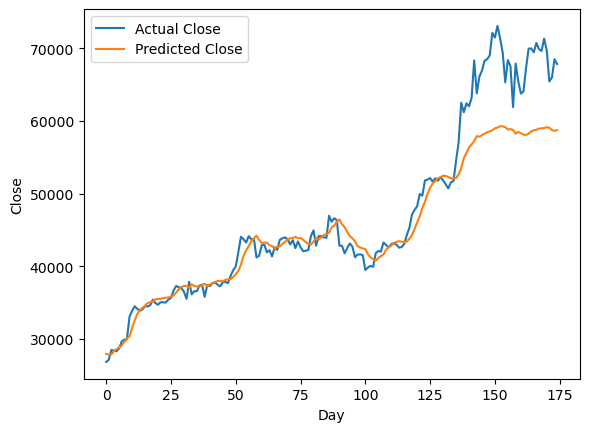
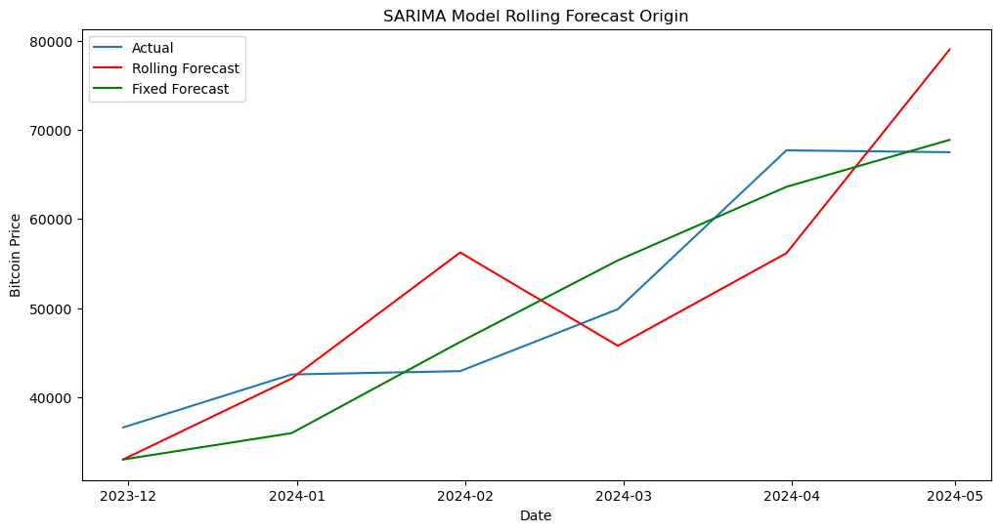
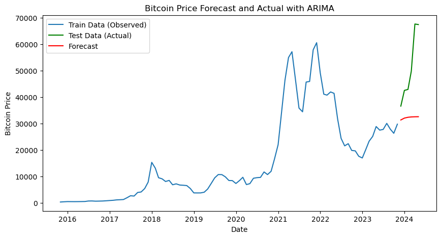

# Results of Bitcoin Price Prediction Models

## Overview
This document presents the results and performance analysis of three different predictive models used in the Bitcoin price prediction project: LSTM with PyTorch, SARIMA, and ARIMA, including a rolling forecast with SARIMA. Each model's performance was evaluated using the Root Mean Squared Error (RMSE).

## LSTM Model Results
### Performance Metrics
- **RMSE**: 4595.60

### Discussion
The LSTM model, implemented in `lstm_model.py`, utilizes deep learning techniques to predict future Bitcoin prices based on sequences of past data. The RMSE indicates the model's accuracy in capturing the volatility and trends of Bitcoin prices.

### Plot

## SARIMA Model Results
### Performance Metrics
- **RMSE**: 4390.43

### Discussion
The SARIMA model, designed to address both seasonal and non-seasonal components of Bitcoin price movements, has shown effective performance in handling the data's cyclic nature. The slightly lower RMSE compared to the LSTM model suggests better handling of seasonal fluctuations.

## Rolling Forecast SARIMA Model Results
### Performance Metrics
- **RMSE**: 8883.15

### Discussion
The rolling forecast approach with SARIMA aimed to utilize the most current data for each prediction, continually updating the model. However, the higher RMSE indicates potential overfitting or model instability when adapting to new data points.

### Plot

## ARIMA Model Results
### Performance Metrics
- **RMSE**: 22379.70

### Discussion
The ARIMA model focuses on non-seasonal patterns and is the simplest among the approaches tested. Its significantly higher RMSE indicates challenges in capturing the complex dynamics of Bitcoin prices without considering seasonal influences.

### Plot

## Comparative Analysis
The comparison of these models shows varying strengths: LSTM and SARIMA provide more nuanced predictions, while ARIMA struggles without seasonal components. The rolling forecast's higher RMSE highlights the challenges in applying this method without adjustments for stability or data peculiarities.

## Conclusion
These results underscore the complexity of predicting Bitcoin prices and the necessity of choosing the right model based on the data characteristics and the specific forecasting needs. Future work could explore hybrid models or enhanced feature engineering to improve predictions and reduce error metrics.
